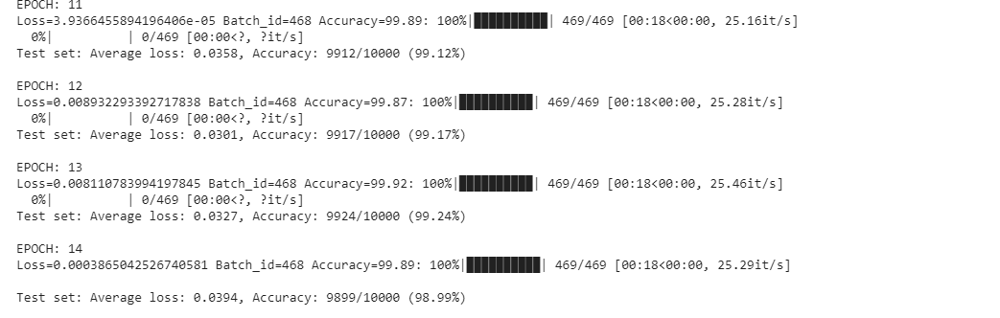
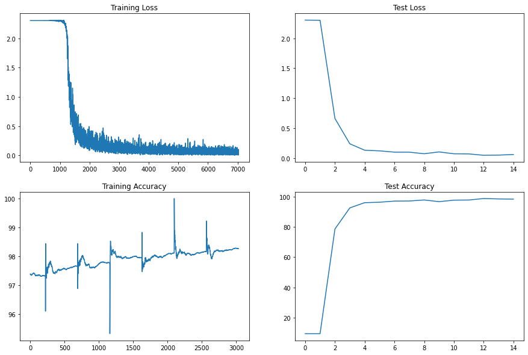
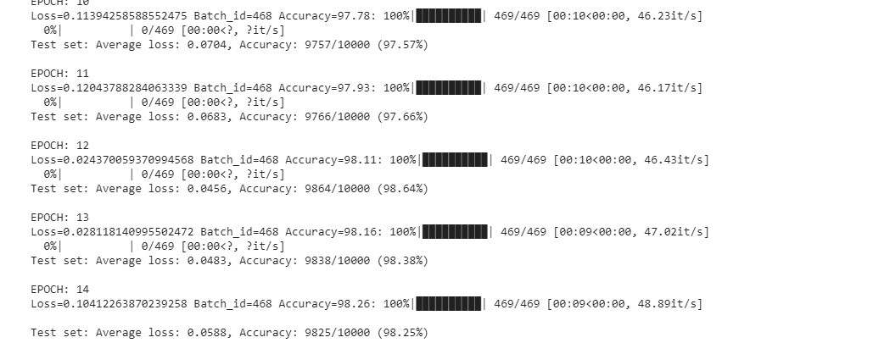

# Session 6 - MNIST Classification

## Step 1 - Setup
[Link to notebook](./notebooks/MNISTClassifier_Step1_Setup.ipynb) 

**Target** : First step is to get a basic structure of code working.

**Results** : 
1.   Parameters: 6,379,786
2.   Best Training accuracy: 99.92%
1.   Best Testing accuracy: 99.24%

**Analysis**:
1.   Number of parameters is large; the number of filters/output channels in hidden layers is large for a simple dataset like MNIST
2.   Model is overfitting; As seen in the image below, training accuracy is already at 99.92% and to reach a test accuracy of 99.4 from 99.24 is difficult

## Step 2 - Reduce number of parameters
[Link to notebook](./notebooks/MNISTClassifier_Step2_ReduceParameters.ipynb) 

**Target** : 
1.   Reduce the number of parameters and make the model lighter with:
* Reduce the number of filters
* Introduce 1X1 filters
* Add GAP layer 
2.   Finalize the base network architecture
* Ensure MaxPool layer is away from output block
* Stop at 7X7

**Results** : 
1.   Parameters: 7,688
2.   Best Training accuracy: 98.26%
1.   Best Testing accuracy: 98.25%

**Analysis**:
1.   Number of parameters reduced to 7K 
2.   Initial epochs have a very low accuracy (< 10%) . At epoch #3 it started increasing to values above 92% and then there was a steady increase to 98% in both training and test accuracy
1.   The model seems to not be overfitting now

## Step 3 - Add Batch Normalization
[Link to notebook](./notebooks/MNISTClassifier_Step3_AddBatchNorm.ipynb) 

**Target** : 
1.   Add Batch Normalization to increase model performance

**Results** : 
1.   Parameters: 7,852
2.   Best Training accuracy: 99.5%
1.   Best Testing accuracy: 99.21%

**Analysis**:
1.  Model is slightly overfitting; maybe its time for regularization 

## Step 4 - Add Dropout
[Link to notebook](./notebooks/MNISTClassifier_Step4_AddDropout.ipynb) 

**Target** : 
1.   Add DropOut to avoid overfitting

**Results** : 
1.   Parameters: 7,852
2.   Best Training accuracy: 99.08%
1.   Best Testing accuracy: 99.11%

**Analysis**:
1.  Model is now not overfitting
2.  There is scope for increasing the capacity of the model with more layers

## Step 5 - Add layers
[Link to notebook](./notebooks/MNISTClassifier_Step5_AddLayers.ipynb) 

**Target** : 
1.   Add layer at the end of architecture to increase the capacity

**Results** : 
1.   Parameters: 10,252
2.   Best Training accuracy: 99.35%
1.   Best Testing accuracy: 99.15%

**Analysis**:
1.  Model is now not overfitting at all
2.  It can be seen that the accuracy is increasing with epochs but the increase is slow. The learning rate needs to be increased slightly

## Step 6 - Modify learning rate
[Link to notebook](./notebooks/MNISTClassifier_Step6_IncreaseLR.ipynb) 

**Target** : 
1.   Add layer at the end of architecture to increase the capacity

**Results** : 
1.   Parameters: 10,252
2.   Best Training accuracy: 99.34%
1.   Best Testing accuracy: 99.43%

**Analysis**:
1.  Model is now not overfitting at all
2.  Increasing learning rate helped achieve test accuracy = 99.4% consistently from epoch #11
1.  Try data augmentation to see if further improvement is possible 

## Step 7 
[Link to notebook](./notebooks/MNISTClassifier_Step7_DataAugmentation.ipynb) 

**Target** : 
1.   Slightly rotate (randomly selected) images in the training dataset 

**Results** : 
1.   Parameters: 10,252
2.   Best Training accuracy: 99.22%
1.   Best Testing accuracy: 99.45%

**Analysis**:
1.  Data augmentation improved the accuracy slightly
2.  The capacity of the model can be increased further 

The training accuracy can be increased further since it is only at 99.22%. 
